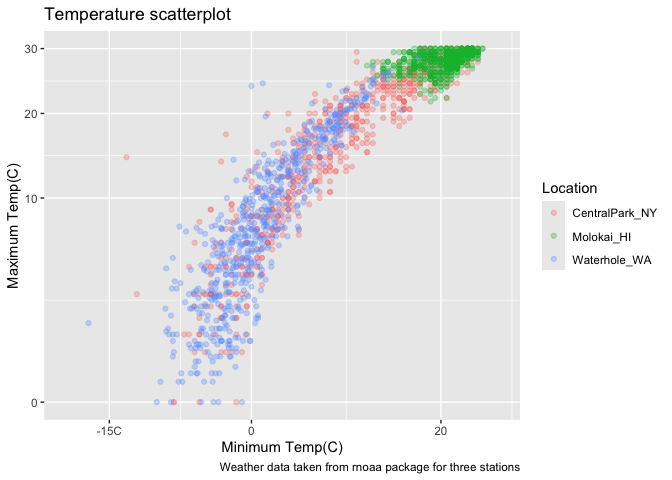
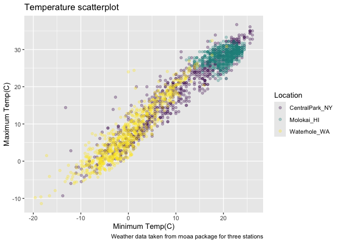
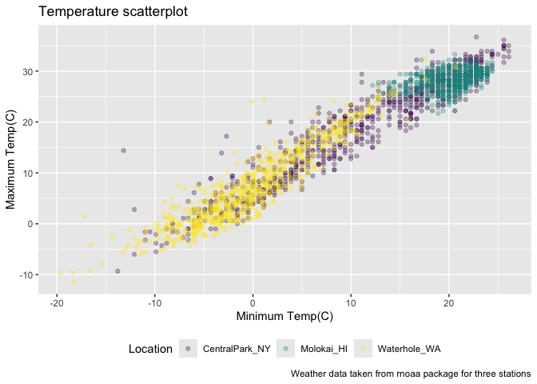
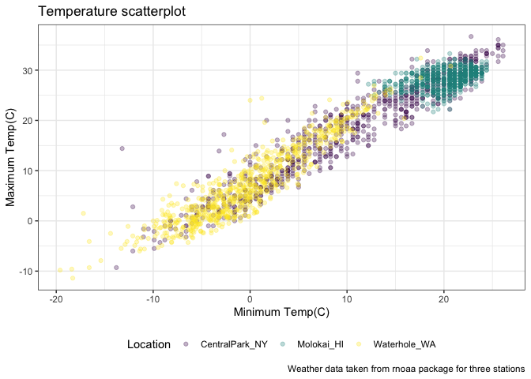
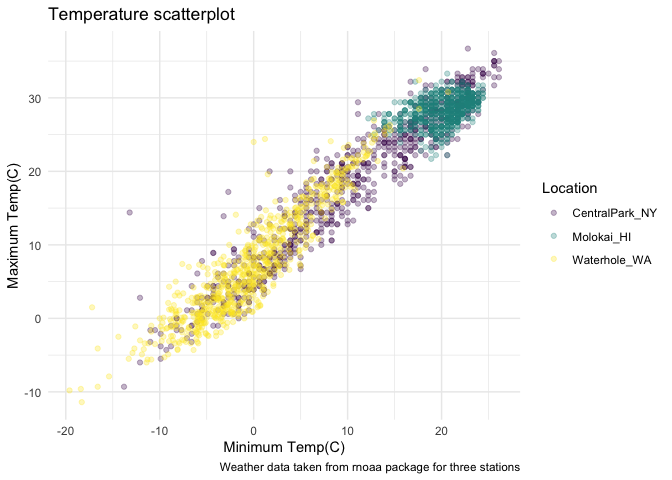
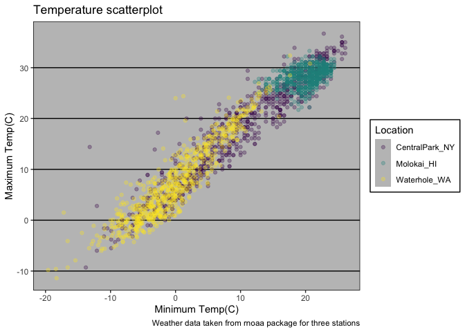
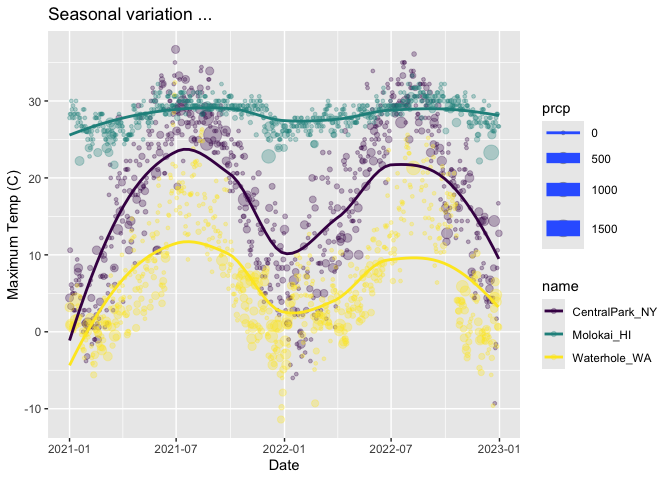
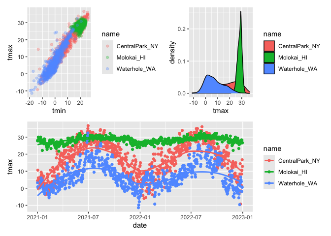

Visualization 2
================
Congyu Yang
2024-10-01

``` r
weather_df = 
  rnoaa::meteo_pull_monitors(
    c("USW00094728", "USW00022534", "USS0023B17S"),
    var = c("PRCP", "TMIN", "TMAX"), 
    date_min = "2021-01-01",
    date_max = "2022-12-31") |>
  mutate(
    name = case_match(
      id, 
      "USW00094728" ~ "CentralPark_NY", 
      "USW00022534" ~ "Molokai_HI",
      "USS0023B17S" ~ "Waterhole_WA"),
    tmin = tmin / 10,
    tmax = tmax / 10) |>
  select(name, id, everything())
```

    ## using cached file: /Users/ivyyang/Library/Caches/org.R-project.R/R/rnoaa/noaa_ghcnd/USW00094728.dly

    ## date created (size, mb): 2024-09-26 10:17:51.939492 (8.651)

    ## file min/max dates: 1869-01-01 / 2024-09-30

    ## using cached file: /Users/ivyyang/Library/Caches/org.R-project.R/R/rnoaa/noaa_ghcnd/USW00022534.dly

    ## date created (size, mb): 2024-09-26 10:18:03.177675 (3.932)

    ## file min/max dates: 1949-10-01 / 2024-09-30

    ## using cached file: /Users/ivyyang/Library/Caches/org.R-project.R/R/rnoaa/noaa_ghcnd/USS0023B17S.dly

    ## date created (size, mb): 2024-09-26 10:18:06.77157 (1.036)

    ## file min/max dates: 1999-09-01 / 2024-09-30

Made a scatterplot but fancy this time.

``` r
weather_df %>% 
  ggplot(aes(x = tmin,y = tmax, color = name))+
  geom_point(alpha = 0.3) +
  labs(
    title = "Temperature scatterplot",
    x = "Minimum Temp(C)",
    y = "Maximum Temp(C)",
    color = "Location",
    caption = "Weather data taken from rnoaa package for three stations"
  ) +
  scale_x_continuous(breaks = c(-15,0,20),
                     labels = c("-15C","0","20"))+
  scale_y_continuous(
    limits = c(0,30),
    transform = "sqrt"
  )
```

    ## Warning in transformation$transform(x): NaNs produced

    ## Warning in scale_y_continuous(limits = c(0, 30), transform = "sqrt"): sqrt
    ## transformation introduced infinite values.

    ## Warning: Removed 302 rows containing missing values or values outside the scale range
    ## (`geom_point()`).

<!-- -->

Look at color

``` r
weather_df %>% 
  ggplot(aes(x = tmin,y = tmax, color = name))+
  geom_point(alpha = 0.3) +
  labs(
    title = "Temperature scatterplot",
    x = "Minimum Temp(C)",
    y = "Maximum Temp(C)",
    color = "Location",
    caption = "Weather data taken from rnoaa package for three stations"
  ) +
  scale_color_hue(h = c(100,400)) +
  viridis::scale_color_viridis(discrete = T)
```

    ## Scale for colour is already present.
    ## Adding another scale for colour, which will replace the existing scale.

    ## Warning: Removed 17 rows containing missing values or values outside the scale range
    ## (`geom_point()`).

<!-- --> \##
Themes

``` r
gg_scatterplot <- weather_df %>% 
  ggplot(aes(x = tmin,y = tmax, color = name))+
  geom_point(alpha = 0.3) +
  labs(
    title = "Temperature scatterplot",
    x = "Minimum Temp(C)",
    y = "Maximum Temp(C)",
    color = "Location",
    caption = "Weather data taken from rnoaa package for three stations"
  ) +
  viridis::scale_color_viridis(discrete = T)
```

``` r
gg_scatterplot +
  theme(legend.position = "bottom")
```

    ## Warning: Removed 17 rows containing missing values or values outside the scale range
    ## (`geom_point()`).

<!-- -->

Change background color change it ahead of time, it is like resetting
everything, if you do legend position first and then reset theme_bw,
legend position will no longer works.

``` r
gg_scatterplot +
  theme_bw()+
  theme(legend.position = "bottom")
```

    ## Warning: Removed 17 rows containing missing values or values outside the scale range
    ## (`geom_point()`).

<!-- -->
order matters…

``` r
gg_scatterplot +
  theme(legend.position = "bottom")+
  theme_minimal()
```

    ## Warning: Removed 17 rows containing missing values or values outside the scale range
    ## (`geom_point()`).

<!-- -->

``` r
gg_scatterplot +
  theme(legend.position = "bottom")+
  theme_classic()
```

    ## Warning: Removed 17 rows containing missing values or values outside the scale range
    ## (`geom_point()`).

<!-- -->

``` r
gg_scatterplot +
  theme(legend.position = "bottom")+
  ggthemes::theme_excel()
```

    ## Warning: Removed 17 rows containing missing values or values outside the scale range
    ## (`geom_point()`).

<!-- --> New
Scatterplot

``` r
weather_df %>% 
  ggplot(aes(x = date,y = tmax,color = name,size = prcp)) +
  geom_point(alpha = 0.3)+
  geom_smooth(se = F)+
  viridis::scale_color_viridis(discrete = T)+
  labs(
    x = "Date",
    y = "Maximum Temp (C)",
    title = "Seasonal variation ..."
  )
```

    ## Warning: Using `size` aesthetic for lines was deprecated in ggplot2 3.4.0.
    ## ℹ Please use `linewidth` instead.
    ## This warning is displayed once every 8 hours.
    ## Call `lifecycle::last_lifecycle_warnings()` to see where this warning was
    ## generated.

    ## `geom_smooth()` using method = 'loess' and formula = 'y ~ x'

    ## Warning: Removed 17 rows containing non-finite outside the scale range
    ## (`stat_smooth()`).

    ## Warning: The following aesthetics were dropped during statistical transformation: size.
    ## ℹ This can happen when ggplot fails to infer the correct grouping structure in
    ##   the data.
    ## ℹ Did you forget to specify a `group` aesthetic or to convert a numerical
    ##   variable into a factor?

    ## Warning: Removed 19 rows containing missing values or values outside the scale range
    ## (`geom_point()`).

<!-- -->

``` r
# not yet finished
```

Extra Bonus stuff in `ggplot` Use different datasets in different
`geom`s

``` r
central_park_df =
  weather_df %>% 
  filter(name == "CentralPark_NY")

molokai_df =
  weather_df %>% 
  filter(name == "Molokai_HI")

molokai_df %>% 
  ggplot(aes(x = date, y = tmax,color = name))+
  geom_point()+
  geom_line(data = central_park_df)
```

    ## Warning: Removed 1 row containing missing values or values outside the scale range
    ## (`geom_point()`).

<!-- --> \##
Multiple Panels

``` r
weather_df %>% 
  ggplot(aes(x = tmax, fill = name))+
  geom_density()+
  facet_grid(. ~ name)
```

    ## Warning: Removed 17 rows containing non-finite outside the scale range
    ## (`stat_density()`).

<!-- -->

``` r
ggp_tmax_tmin =
  weather_df %>% 
  ggplot(aes(x = tmin,y = tmax,color = name))+
  geom_point(alpha = 0.3)

ggp_tmax_density =
  weather_df %>% 
  ggplot(aes(x = tmax, fill = name))+
  geom_density()

ggp_tmax_date =
  weather_df %>% 
  ggplot(aes(x = date,y = tmax, color = name))+
  geom_point()+
  geom_smooth(se = F)

(ggp_tmax_tmin + ggp_tmax_density)/ggp_tmax_date
```

    ## Warning: Removed 17 rows containing missing values or values outside the scale range
    ## (`geom_point()`).

    ## Warning: Removed 17 rows containing non-finite outside the scale range
    ## (`stat_density()`).

    ## `geom_smooth()` using method = 'loess' and formula = 'y ~ x'

    ## Warning: Removed 17 rows containing non-finite outside the scale range
    ## (`stat_smooth()`).

    ## Warning: Removed 17 rows containing missing values or values outside the scale range
    ## (`geom_point()`).

<!-- --> \##
Data Manipulation
